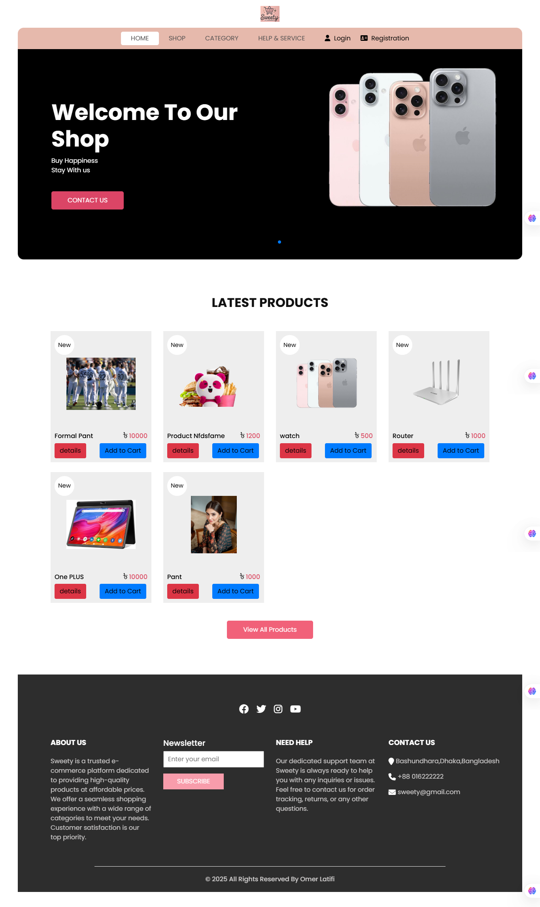
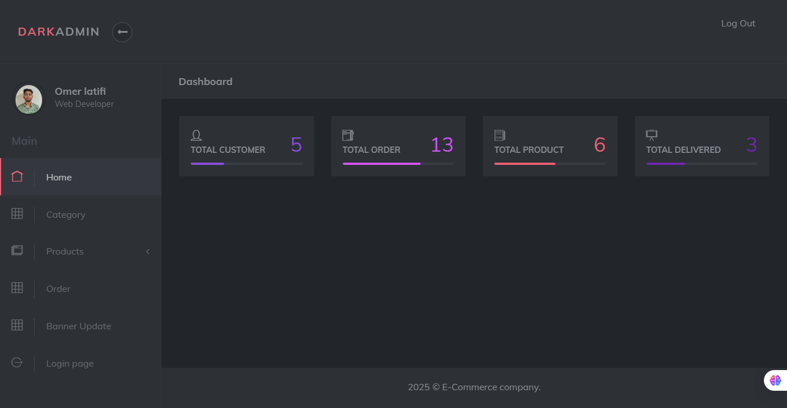
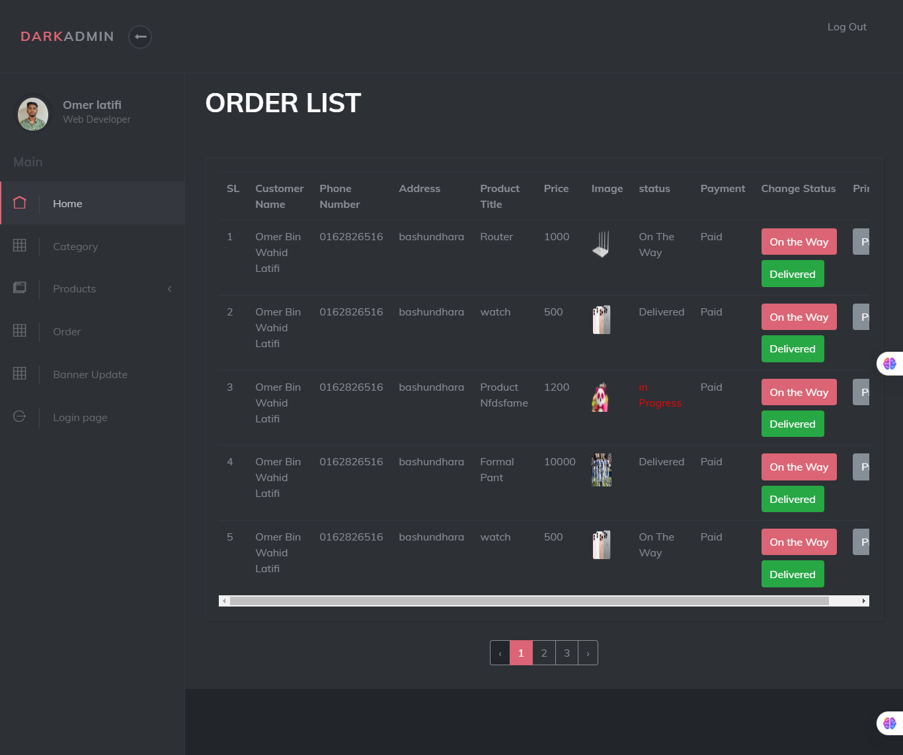
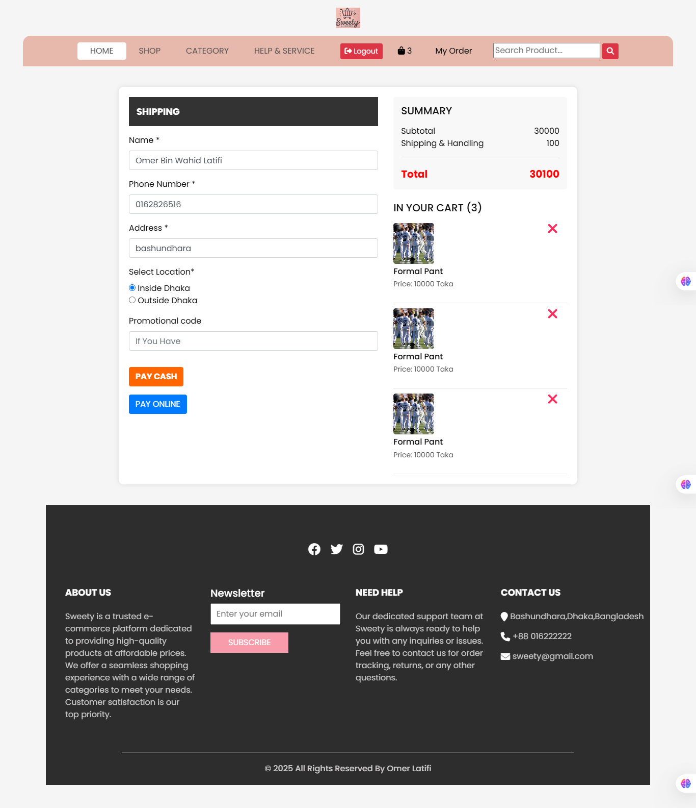
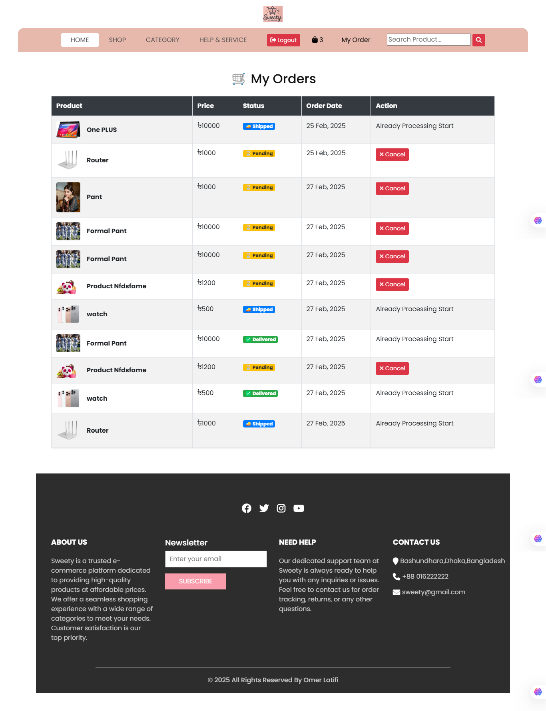

# Project Name
A brief one-liner about your project.  
Example: "An e-commerce website built with Laravel, MySQL, and Bootstrap."

---

## 🔹 Features
- Feature 1 (e.g., User authentication with email verification)
- Feature 2 (e.g., Product CRUD management)
- Feature 3 (e.g., Cart and checkout system)
- Feature 4 (e.g., Admin panel for managing users and orders)
- Feature 5 (Optional: REST API endpoints)

---

## 🔹 Screenshots
Since the project is not live, use screenshots from your local environment. Save them in a folder called `/screenshots` inside your repo.  

Example:

  
  



---

## 🔹 Tech Stack
- **Backend:** PHP, Laravel  
- **Frontend:** HTML, CSS, Bootstrap, JS  
- **Database:** MySQL  
- **Others:** Composer, Git, REST API, Stripe 

---

## 🔹 Installation Steps (for local use)
1. Clone the repository:
```bash
git clone https://github.com/omerlatifi/Laravel-E-Commerce-Site.git
2.Move to the project directory:
cd Laravel-E-Commerce-Site
composer install

